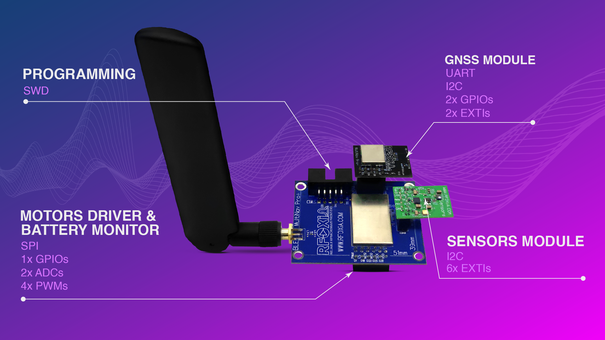
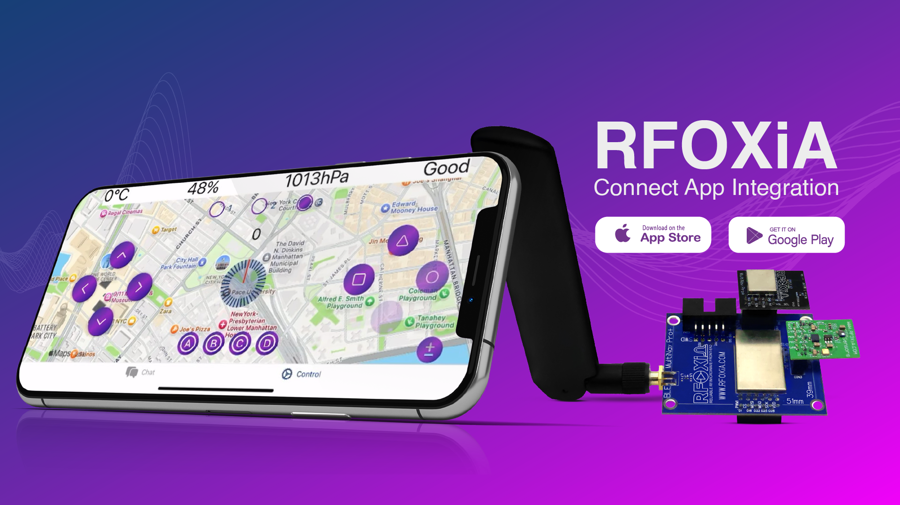
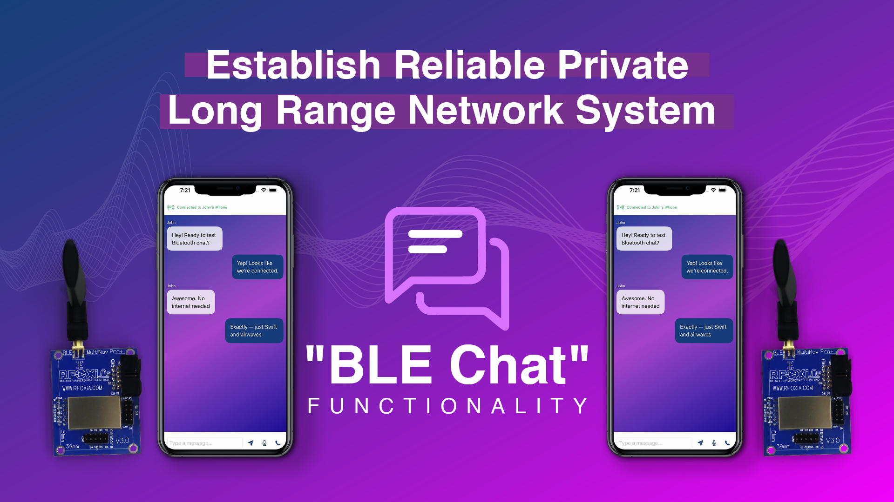
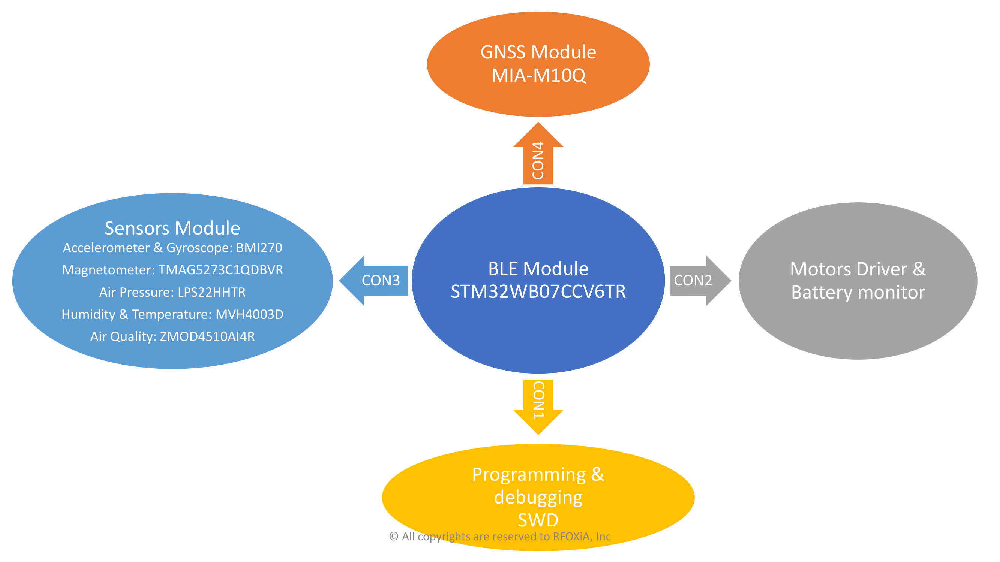
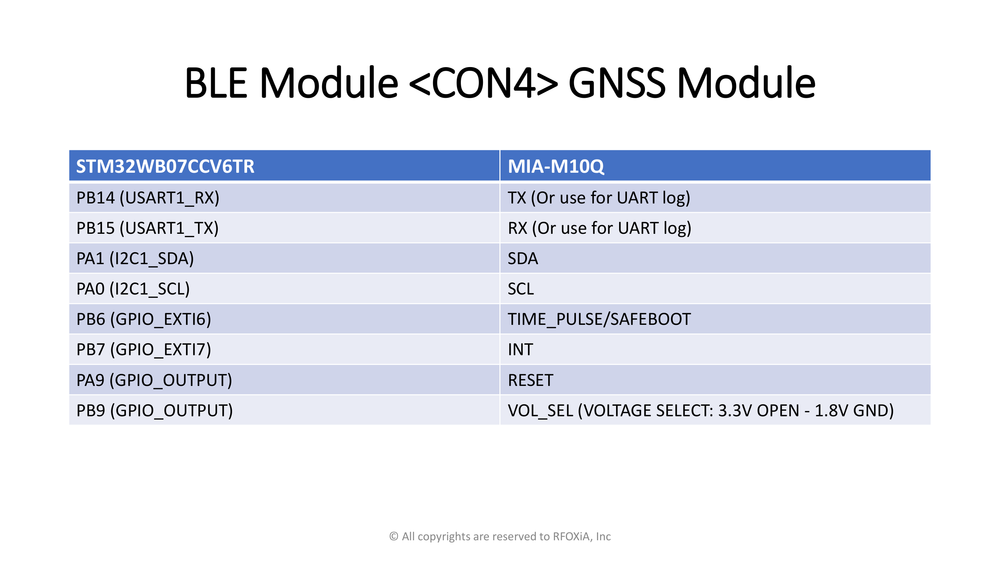
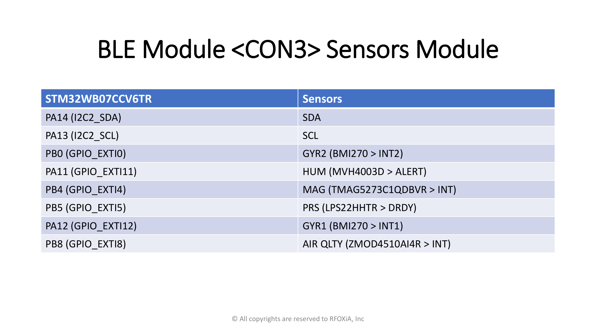
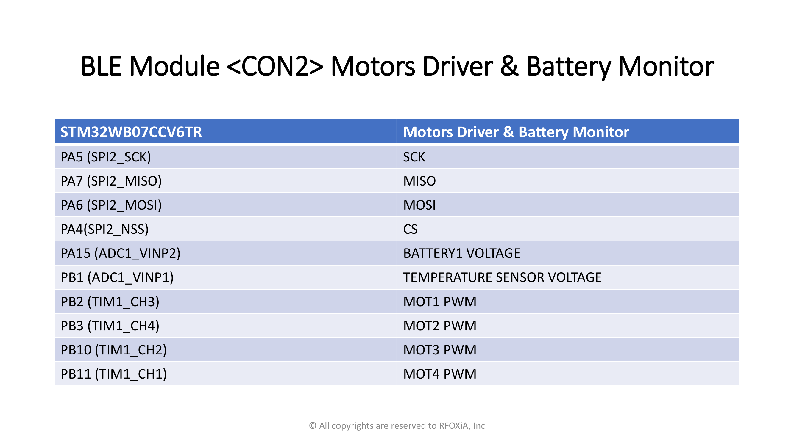
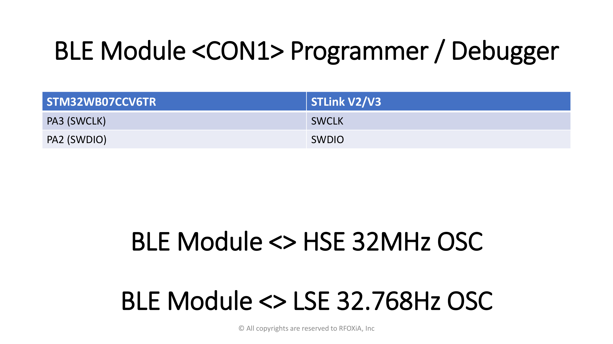
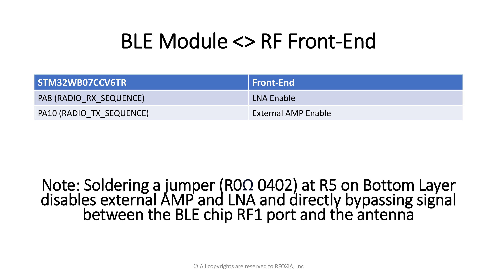
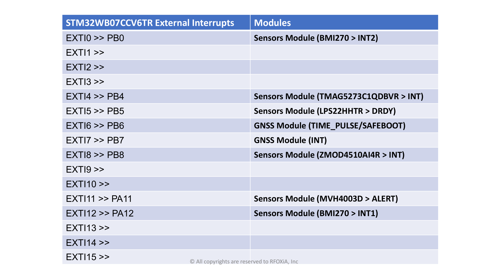

# MultiNav Pro+ BLE Module Firmware V2.0

© RFOXiA, Inc. — **All rights reserved to RFOXiA, Inc.**

This firmware is published as **open source**. You are welcome to read, build, run, and study the code. RFOXiA, Inc. retains all rights to the MultiNav Pro+ product, its brand, and this firmware.

---

## ⚡ Get the MultiNav Pro+ Long-Range BLE Module

This firmware runs on the **[MultiNav Pro+ premium long-range BLE module](https://rfoxia.com/premium-ble-module/)** — a compact STM32WB07-based module with Coded PHY long-range Bluetooth, integrated GNSS, multi-sensor telemetry, and motor control, ready to drop into your product.

<p>
  <a href="https://rfoxia.com/premium-ble-module/"><b>➤ Explore the Premium BLE Module — rfoxia.com/premium-ble-module</b></a>
</p>

📚 **All documentation, resources, tutorials, and community support are available at [RFOXiA Club](https://club.rfoxia.com/)** — your hub for datasheets, integration guides, app downloads, and firmware updates: **https://club.rfoxia.com/**

---

## 📱 Companion App — RFOXiA Connect

Control, automate, and chat with your MultiNav Pro+ modules from your phone. **RFOXiA Connect** is the official companion app for this firmware — live sensor telemetry, motor control, automation routines, and internet-independent long-range chat with voice messages.

<p>
  <a href="https://apps.apple.com/us/app/rfoxia-connect/id6759990021"></a>&nbsp;&nbsp;<a href="https://play.google.com/store/apps/details?id=com.rfoxia.club"></a>
</p>

| Platform | Link |
|----------|------|
| iOS (App Store) | https://apps.apple.com/us/app/rfoxia-connect/id6759990021 |
| Android (Google Play) | https://play.google.com/store/apps/details?id=com.rfoxia.club |
| App overview | https://rfoxia.com/rfoxia-connect-app/ |

---

## 1. Overview

Firmware for the **MultiNav Pro+ BLE module**, based on the **STM32WB07CC** wireless microcontroller (Cortex-M0+, Bluetooth Low Energy 5.x).

Key capabilities:

- **Dual-role BLE** — the module runs as a GATT server (for phones) and a GATT client (for peer modules) simultaneously, with module-to-module relay.
- **Long range** — Coded PHY (S=8) support with high TX power (+8 dBm).
- **Chat relay** — text/data messages relayed between a phone and a remote module, with ACK delivery receipts.
- **Multi-sensor telemetry** — IMU, barometer, gas/air quality, magnetic, humidity, and GNSS positioning streamed over BLE notifications.
- **Motor / actuator control** — dedicated GATT service for remote control commands.
- **Low-power operation** — tiny LPM and sequencer-based scheduling.

For deep dives, see the companion guides:

| Document | Contents |
|----------|----------|
| `ARCHITECTURE_AND_DESIGN.md` | System architecture, task scheduling, memory layout, design decisions |
| `DUAL_ROLE_AND_CONNECTIONS.md` | Dual-role BLE, connection lifecycle, PHY negotiation, retry logic |
| `INTEGRATION_AND_OPERATIONS.md` | Build, flash, and debug instructions; CubeMX configuration reference |
| `SENSORS_AND_PERIPHERALS.md` | Sensor drivers, I²C/SPI/UART buses, DMA pipelines, GNSS integration |
| `BUILD_INFO.txt` | Snapshot of the build configuration |
| [`docs/BLE Module System Diagram.pdf`](docs/BLE%20Module%20System%20Diagram.pdf) | Full hardware system diagram (rendered below) |

---

<a href="https://rfoxia.com/premium-ble-module/"></a>

<a href="https://rfoxia.com/premium-ble-module/"></a>

<a href="https://rfoxia.com/premium-ble-module/"></a>

---

## System Diagram

Full hardware system diagram of the MultiNav Pro+ BLE module ([PDF version](docs/BLE%20Module%20System%20Diagram.pdf)).

### 1. System Overview


### 2. GNSS Module — MIA-M10Q (CON4)


### 3. Sensors Module (CON3)


### 4. Motors Driver & Battery Monitor (CON2)


### 5. Programmer / Debugger — ST-Link (CON1) & HSE Oscillator


### 6. RF Front-End


### 7. External Interrupt Mapping


---

## 2. Requirements

- **STM32CubeIDE** 1.19.0 or later
- **ST-LINK** (or compatible SWD probe) for flashing and debugging
- Target hardware: MultiNav Pro+ module (STM32WB07CCVx)

---

## 3. Getting Started

### Build

1. Open **STM32CubeIDE**
2. `File → Open Projects from File System…` → select this `Firmware/` folder
3. `Project → Clean Project`
4. `Project → Build Project` (Ctrl+B)
5. Look for `Build Finished. 0 errors.` in the Console
6. Output binary: `Debug/BLE Pro test Debug.elf`

### Flash

Flash with **STM32CubeProgrammer** over SWD (recommended — flashing directly from the IDE often does not work correctly with this module):

1. Connect an ST-LINK (V2/V3) to the module's SWD pins (see the system diagram below)
2. Open **STM32CubeProgrammer** and connect (ST-LINK, SWD, Mode: *Under reset* if the target doesn't attach)
3. Drag and drop the new firmware hex file to **STM32CubeProgrammer**
4. Press **Download** to flash the new firmware

See `INTEGRATION_AND_OPERATIONS.md` for detailed instructions and troubleshooting.

---

## 4. Repository Structure

```
Firmware/
├── README.md                        ← this file
├── ARCHITECTURE_AND_DESIGN.md       ← architecture & design guide
├── DUAL_ROLE_AND_CONNECTIONS.md     ← BLE dual-role & connection guide
├── INTEGRATION_AND_OPERATIONS.md    ← build / flash / debug guide
├── SENSORS_AND_PERIPHERALS.md       ← sensors & peripherals guide
├── BUILD_INFO.txt                   ← build configuration snapshot
├── BLE Pro test.ioc                 ← STM32CubeMX project (pin & peripheral config)
├── BLE Pro test Debug.launch        ← STM32CubeIDE debug/flash configuration
├── BLE Pro test Debug.cfg           ← Debug probe (OpenOCD) configuration
├── STM32WB07CCVX_FLASH.ld           ← Linker script (flash/RAM memory map)
├── .cproject / .project / .settings ← STM32CubeIDE (Eclipse CDT) project files
├── .mxproject                       ← CubeMX generation metadata
│
├── Core/                            ← Application core & sensor drivers
│   ├── Inc/                         ← Headers
│   │   ├── main.h, app_conf.h       ← App entry & BLE stack configuration
│   │   ├── app_entry.h, app_common.h
│   │   ├── ble_notification_queue.h ← Outbound BLE notification queue
│   │   ├── sensor_scheduler.h       ← Round-robin sensor sampling scheduler
│   │   ├── bmi270*.h, bmi2*.h       ← Bosch BMI270 IMU driver
│   │   ├── LPS22HH.h                ← ST LPS22HH barometer driver
│   │   ├── zmod4510*.h, zmod4xxx*.h, ulp_o3.h ← Renesas ZMOD4510 gas sensor (O₃/NO₂)
│   │   ├── tmag5273.h               ← TI TMAG5273 3-axis magnetic sensor
│   │   ├── mvh4000d.h               ← MVH4000D humidity sensor
│   │   ├── gnss_mia_m10q.h          ← u-blox MIA-M10Q GNSS receiver driver
│   │   ├── imu_dma.h, dma_config.h  ← Autonomous DMA pipelines
│   │   ├── i2c.h, spi.h, usart.h, gpio.h, rtc.h, rng.h, pka.h ← Peripheral setup
│   │   ├── radio.h, radio_timer.h   ← BLE radio & radio timer glue
│   │   ├── debug_log.h              ← UART debug logging
│   │   └── stm32wb0x_hal_conf.h, stm32wb0x_it.h ← HAL config & interrupt handlers
│   ├── Src/                         ← Implementations (one .c per header above)
│   │   ├── main.c                   ← System init & main loop
│   │   ├── app_entry.c              ← Application/BLE stack bring-up
│   │   ├── sensor_scheduler.c       ← Sensor sampling orchestration
│   │   ├── gnss_mia_m10q.c          ← GNSS UART/DMA parsing (NMEA/UBX)
│   │   └── …                        ← Sensor, bus, and system sources
│   └── Startup/
│       └── startup_stm32wb07ccvx.s  ← Vector table & reset handler (assembly)
│
├── STM32_BLE/                       ← BLE application layer
│   ├── App/
│   │   ├── app_ble.c/.h             ← BLE stack init, GAP, advertising, scanning
│   │   ├── dual_role_manager.c/.h   ← Central+peripheral dual-role state machine
│   │   ├── gatt_client_app.c/.h     ← GATT client (module-to-module link)
│   │   ├── chat_server.c/.h         ← Chat GATT service (definitions)
│   │   ├── chat_server_app.c/.h     ← Chat logic, relay & ACK delivery receipts
│   │   ├── sensor_server.c/.h       ← Sensor telemetry GATT service
│   │   ├── sensor_server_app.c/.h   ← Sensor notification logic
│   │   ├── motor_server.c/.h        ← Motor/actuator control GATT service
│   │   ├── motor_server_app.c/.h    ← Motor command handling
│   │   ├── bconnection_server.c/.h  ← Connection management GATT service
│   │   ├── bconnection_server_app.c/.h
│   │   ├── uart_relay_service.c/.h  ← UART-over-BLE relay service
│   │   └── ble_conf.h               ← BLE services configuration
│   └── Target/
│       ├── bleplat.c, bleplat_cntr.c ← BLE platform abstraction (radio glue)
│       └── blenvm.c/.h              ← BLE non-volatile memory (bonding storage)
│
├── Drivers/                         ← Vendor HAL & CMSIS (ST-provided)
│   ├── CMSIS/                       ← ARM CMSIS core + STM32WB0x device headers
│   └── STM32WB0x_HAL_Driver/        ← STM32WB0x HAL peripheral drivers
│
├── Middlewares/
│   └── ST/STM32_BLE/                ← ST BLE stack (link layer, host, PKA)
│       └── stack/                   ← Stack config, headers & prebuilt library
│
├── System/                          ← ST system layer
│   ├── Config/Debug_GPIO/           ← Debug pin mapping
│   └── Interfaces/                  ← HW interface glue (flash, RNG, PKA, radio)
│
├── Utilities/                       ← ST utility components
│   ├── sequencer/                   ← Cooperative task sequencer (main scheduler)
│   ├── lpm/tiny_lpm/                ← Low-power manager
│   ├── trace/adv_trace/             ← Trace/logging transport
│   └── misc/                        ← Memory & queue helpers
│
└── Projects/
    └── Common/BLE/                  ← Shared BLE project modules (queues, utils)
```

---

## 5. Firmware Highlights (V2.0)

- **48 GATT attributes** configured — supports all five custom services simultaneously.
- **Robust connection sequencing** — DLE → MTU exchange → CCCD subscribe → Coded PHY switch.
- **Reason-gated reconnect** — initiator-only retry on disconnect reasons `0x13`/`0x16`, with connecting-state guard.
- **Peer classification** — static-random-address detection distinguishes phone vs. module peers.
- **Chat relay with runtime handles** — messages relayed phone ↔ module ↔ module with end-to-end ACK receipts.
- **GNSS pipeline** — 192-byte DMA ring buffer, NMEA disabled via UBX-CFG-VALSET, UBX-only parsing with stream flush.
- **Scan duty cycle 90 ms** — fast peer discovery while advertising.

---

## 6. License

Copyright © RFOXiA, Inc. All rights reserved.

This source code is made available as open source for transparency, education, and community review. Redistribution or commercial use of the MultiNav Pro+ name, branding, or hardware designs requires prior written permission from RFOXiA, Inc.

Third-party components retain their respective licenses:

- STM32 HAL, BLE stack, CMSIS — STMicroelectronics / ARM license terms (see file headers)
- BMI270 driver — Bosch Sensortec license (see file headers)
- ZMOD4xxx driver — Renesas license (see file headers)

---

## 🔗 Links

| Resource | URL |
|----------|-----|
| 🛒 MultiNav Pro+ Premium BLE Module | https://rfoxia.com/premium-ble-module/ |
| 📚 Documentation & Resources — RFOXiA Club | https://club.rfoxia.com/ |
| 📱 RFOXiA Connect app (iOS) | https://apps.apple.com/us/app/rfoxia-connect/id6759990021 |
| 📱 RFOXiA Connect app (Android) | https://play.google.com/store/apps/details?id=com.rfoxia.club |
| 🌐 RFOXiA website | https://rfoxia.com/ |
